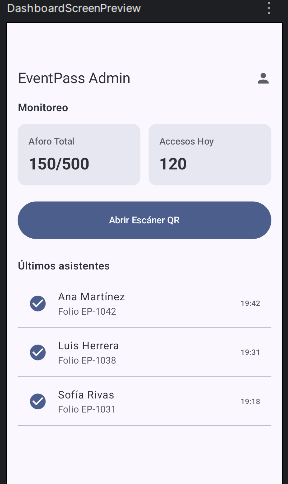

# EventPass App — Control de Asistencia a Eventos con QR

Aplicación móvil desarrollada en **Android Studio** utilizando **Kotlin** y **Jetpack Compose**. El proyecto permite gestionar el acceso y control de asistencia a eventos mediante el escaneo de códigos QR en tiempo real.

---

## 🎨 Diseños de Interfaz (Figma)

El diseño UI/UX se conceptualizó previamente en Figma y se implementó de manera declarativa con Jetpack Compose:

| 1. Splash Screen | 2. Home Screen | 3. Escáner QR / Detalle (Opcional) |
| :---: | :---: | :---: |
|  |  |  |

---

## 📱 Vistas Implementadas

1. **Splash Screen:** Pantalla de carga con identidad visual de la app y transición automática al panel principal.
2. **Home Screen:** Dashboard principal con información del evento activo, indicador de aforo y acceso al lector QR.
3. **Escáner QR (Vista Opcional):** Interfaz para accionar la cámara del dispositivo, validar credenciales en tiempo real y registrar el ingreso del asistente.

---

## 🛠️ Tecnologías y Herramientas

* **Lenguaje:** Kotlin
* **UI Framework:** Jetpack Compose (Material Design 3)
* **Diseño:** Figma
* **IDE:** Android Studio
* **Control de Versiones:** Git / GitHub

---

## 🔗 Enlace al Repositorio
`https://github.com/Arias313/EventPass-App`
