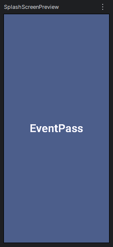
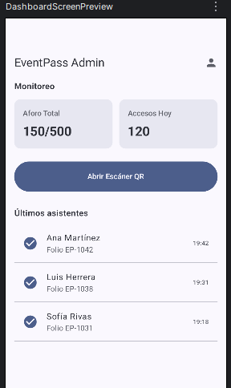
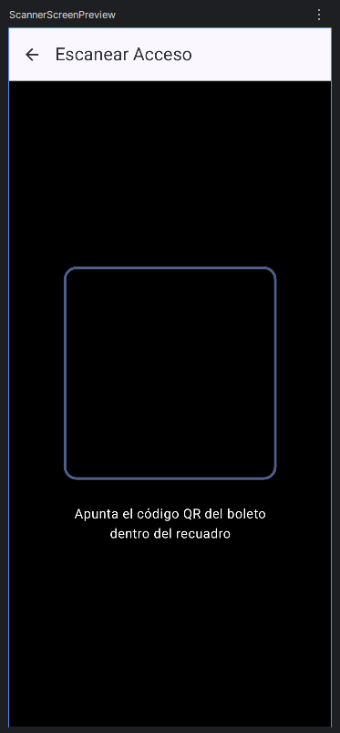

# EventPass App — Control de Asistencia a Eventos con QR

Aplicación móvil desarrollada para Android con **Kotlin** y **Jetpack Compose**. El proyecto permite gestionar el acceso y control de asistencia a eventos mediante el escaneo de códigos QR, utilizando una arquitectura **Offline-First** y el patrón **MVVM** para garantizar un rendimiento óptimo y escalable.

---

## 🎨 Diseños de Interfaz

El diseño UI/UX se conceptualizó previamente en Figma y se implementó de manera declarativa con Jetpack Compose:

| 1. Splash Screen | 2. Home Screen | 3. Escáner QR |
| :---: | :---: | :---: |
|  |  |  |

---

## 📱 Vistas Implementadas y Funciones Clave

1. **Splash Screen:** Pantalla de inicio con identidad visual, temporizador y transición automática al panel principal.
2. **Home Screen (Dashboard):** Panel central con monitoreo de aforo en tiempo real, conteo de accesos y botón de navegación al lector.
3. **Escáner QR Inteligente:** Interfaz con integración en vivo a CameraX y gestión de permisos. Incluye **retroalimentación háptica (vibración)** y **estados visuales dinámicos** (recuadros verde/rojo) que reaccionan a la validación del boleto procesada por el ViewModel.

---

## 🏛️ Arquitectura y Lógica

El proyecto sigue el patrón de diseño **MVVM (Model-View-ViewModel)**, separando estrictamente la interfaz gráfica de la lógica de negocio. El esqueleto de la aplicación está preparado para un enfoque **Offline-First** (híbrido), garantizando que la app pueda operar rápidamente con almacenamiento local y sincronizarse con la nube.

---

## 🛠️ Tecnologías y Herramientas

* **Lenguaje:** Kotlin
* **UI Framework:** Jetpack Compose (Material Design 3)
* **Arquitectura:** MVVM, Navegación con Jetpack Navigation
* **Motor de Escaneo:** CameraX & Google ML Kit Barcode Scanning
* **Backend y Autenticación:** Firebase (Auth y Cloud Firestore)
* **Base de Datos Local:** Room (SQLite)
* **Conexión Web API:** Retrofit
* **Gestión Multimedia:** Cloudinary
* **Diseño & IDE:** Figma, Android Studio
* **Control de Versiones:** Git / GitHub

---
## VIDEO DE FUNCIONALIDAD DE LA APP
https://drive.google.com/drive/folders/1lM1_-6mu0MgY1J8j-XGGuRATGK7SJaUj

## 🔗 Enlace al Repositorio
https://github.com/Arias313/EventPass-app-